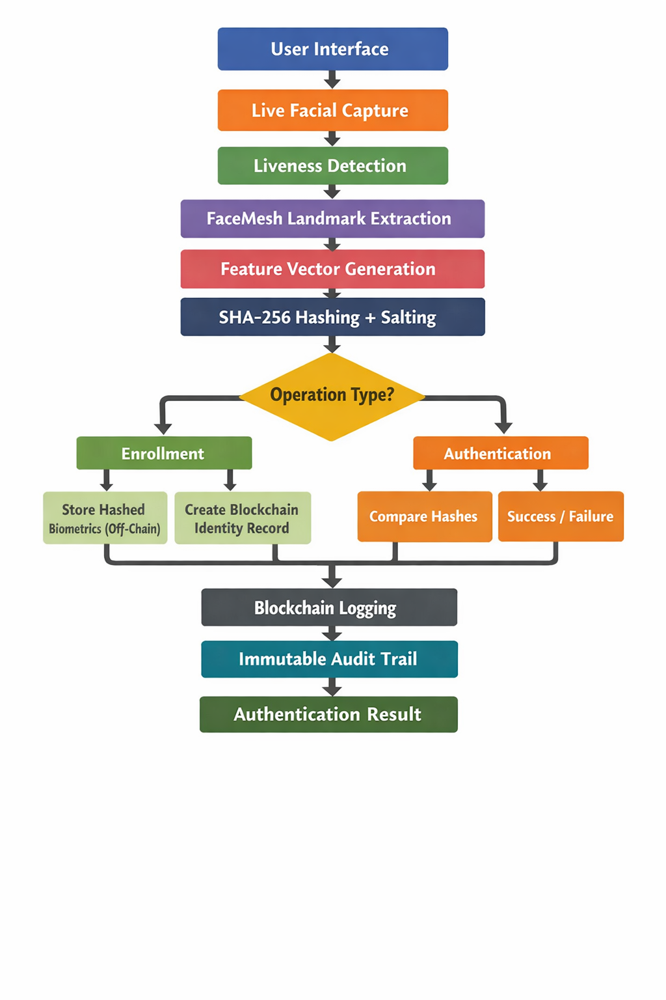

<div align="center">


# TrueID

**Decentralized Biometric Identity System**

[](https://opensource.org/licenses/MIT)
[](https://nodejs.org)
[](https://reactjs.org)
[](https://www.postgresql.org)
[](https://www.avax.network)
[](https://developer.android.com)

Secure biometric authentication backed by blockchain — tamper-proof, privacy-first, and built for scale.

[](https://youtube.com/watch?v=demo)
[](https://demo.trueid.dev)

</div>

---

## Overview

TrueID combines biometric authentication with blockchain technology to create a tamper-proof, decentralized identity management system. Users register once, verify with their face, and carry a cryptographically-secured identity that no central authority can alter or revoke.

---

## 📑 Table of Contents

- [Overview](#-system-overview)
- [Features](#-key-features)
- [Architecture](#-architecture)
- [Getting Started](#-getting-started)
- [Security](#-security-features)
- [Development](#-development-guidelines)
- [Contributing](#-contributing)
- [Support](#-support)

## 🌟 Key Features

<div align="center">
  <table>
    <tr>
      <td align="center">
        
        <br />
        <b>Biometric Auth</b>
        <br />
        <sub>Secure face recognition</sub>
      </td>
      <td align="center">
        
        <br />
        <b>Blockchain</b>
        <br />
        <sub>Immutable records</sub>
      </td>
      <td align="center">
        
        <br />
        <b>Privacy</b>
        <br />
        <sub>End-to-end encryption</sub>
      </td>
    </tr>
    <tr>
      <td align="center">
        
        <br />
        <b>Mobile App</b>
        <br />
        <sub>Cross-platform</sub>
      </td>
      <td align="center">
        
        <br />
        <b>Gov Portal</b>
        <br />
        <sub>Admin dashboard</sub>
      </td>
      <td align="center">
        
        <br />
        <b>Security</b>
        <br />
        <sub>Multi-factor auth</sub>
      </td>
    </tr>
  </table>
</div>

## 📋 System Overview

TrueID combines blockchain technology with biometric authentication to create a tamper-proof identity management system. The system consists of the following components:

<details>
<summary><b>📱 1. Android Mobile App</b></summary>

- 📝 **User Registration**: Streamlined onboarding process
- 🔍 **Biometric Auth**: ML Kit Face Detection integration
- 📊 **Identity Management**: Professional profile versioning
- 💎 **Blockchain Wallet**: Secure transaction verification
- 🔒 **Data Security**: Encrypted storage
- 📡 **Offline Mode**: Authentication without internet
- 📱 **QR Codes**: Easy identity sharing
- 📸 **CameraX**: Advanced camera features
- 🔄 **Retrofit**: Efficient API communication

</details>

<details>
<summary><b>🖥️ 2. Backend Server</b></summary>

- 🌐 **RESTful API**: Node.js/Express.js endpoints
- 🔑 **Auth System**: JWT with refresh tokens
- ⛓️ **Blockchain**: Ethers.js integration
- 💾 **Database**: PostgreSQL operations
- 🔐 **Biometric**: SHA-256 hashing
- 🛡️ **Security**: Rate limiting & validation
- 🔔 **Webhooks**: Event notifications
- 🛡️ **Helmet**: Enhanced security headers
- 📝 **Morgan**: Request logging

</details>

<details>
<summary><b>⛓️ 3. Blockchain Layer</b></summary>

- 📜 **Smart Contracts**: Avalanche Fuji deployment
- ✍️ **Multi-sig**: Identity verification
- 📚 **History**: Immutable records
- ⏱️ **Audit Trail**: Timestamp verification
- 👥 **Access Control**: Role-based permissions
- 💰 **Gas Optimization**: Cost-effective transactions

</details>

<details>
<summary><b>🌐 4. Frontend Web Application</b></summary>

- ⚛️ **React.js**: Modern UI with Material UI
- 📱 **Responsive**: All device support
- 🔗 **Web3**: Blockchain integration
- 🔐 **Auth**: Secure token management
- 🎨 **UI/UX**: User-friendly interface
- 🔄 **Real-time**: Polling updates

</details>

<details>
<summary><b>🏛️ 5. Government Portal</b></summary>

- ⚛️ **React.js**: Tailwind CSS dashboard
- 👥 **RBAC**: Administrative hierarchy
- 📋 **Identity**: Detailed user profiles
- 🔍 **Records**: Search & filtering
- 📊 **Analytics**: Audit trail viewing
- 📈 **Stats**: Real-time visualization
- 🛠️ **Dev Mode**: Testing tools
- ♿ **Accessibility**: Headless UI
- ✨ **Animations**: Framer Motion

</details>

<details>
<summary><b>🔧 6. C Client</b></summary>

- ⚡ **Lightweight**: Embedded systems
- 🔌 **API Client**: Backend integration
- 📦 **Minimal**: Few dependencies

</details>

## 🏗️ Architecture

<div align="center">
  
  <br/>
  <sub><i>TrueID System Architecture</i></sub>
</div>

## 📁 Project Structure

```bash
TrueID/
├── 📱 android-app/         # Mobile application
│   ├── 📂 app/            # Android source
│   │   ├── 📂 src/        # Source code
│   │   └── 📄 build.gradle # Build config
│   └── 📂 gradle/         # Gradle wrapper
├── 🖥️ backend/            # Node.js server
│   ├── ⛓️ blockchain/     # Smart contracts
│   ├── ⚙️ config/         # Config files
│   ├── 🎮 controllers/    # API controllers
│   ├── 🔌 middleware/     # Express middleware
│   ├── 📊 models/         # Database models
│   ├── 🛣️ routes/         # API routes
│   ├── 🛠️ services/       # Business logic
│   └── 🧰 utils/          # Utilities
├── 🔧 c-client/           # C implementation
├── 💾 database/           # DB schemas
├── 🌐 frontend/           # React web app
├── 🏛️ government-portal/  # Admin dashboard
│   ├── 📂 public/         # Static assets
│   ├── 📂 src/            # React components
│   └── 📄 package.json    # Dependencies
└── 📜 scripts/            # Utilities
```

## 🚀 Getting Started

### 📋 Prerequisites

<div align="center">
  <table>
    <tr>
      <td align="center">
        <a href="https://nodejs.org">
          
          <br/>
          <sub>Node.js v14+</sub>
        </a>
      </td>
      <td align="center">
        <a href="https://www.postgresql.org">
          
          <br/>
          <sub>PostgreSQL v13+</sub>
        </a>
      </td>
      <td align="center">
        <a href="https://developer.android.com/studio">
          
          <br/>
          <sub>Android Studio</sub>
        </a>
      </td>
    </tr>
    <tr>
      <td align="center">
        <a href="https://www.oracle.com/java/technologies/downloads/">
          
          <br/>
          <sub>JDK 8+</sub>
        </a>
      </td>
      <td align="center">
        <a href="https://metamask.io">
          
          <br/>
          <sub>Metamask</sub>
        </a>
      </td>
      <td align="center">
        <a href="https://docs.avax.network/quickstart/fuji-workflow">
          
          <br/>
          <sub>Avalanche Fuji</sub>
        </a>
      </td>
    </tr>
  </table>
</div>

### ⚙️ Installation

<div align="center">
  <table>
    <tr>
      <td align="center">
        <b>1. Clone</b>
        <br/>
        <code>git clone https://github.com/notcaliper/TrueID.git</code>
      </td>
      <td align="center">
        <b>2. Backend</b>
        <br/>
        <code>cd backend && npm install</code>
      </td>
      <td align="center">
        <b>3. Database</b>
        <br/>
        <code>cd database && npm run migrate</code>
      </td>
    </tr>
    <tr>
      <td align="center">
        <b>4. Frontend</b>
        <br/>
        <code>cd frontend && npm install</code>
      </td>
      <td align="center">
        <b>5. Portal</b>
        <br/>
        <code>cd government-portal && npm install</code>
      </td>
      <td align="center">
        <b>6. Deploy</b>
        <br/>
        <code>cd backend && npm run blockchain:deploy:fuji</code>
      </td>
    </tr>
  </table>
</div>

### ⚙️ Configuration

<details>
<summary><b>🔐 Environment Variables</b></summary>

#### Backend (.env)
```env
# Server Configuration
PORT=5000
NODE_ENV=development
FRONTEND_URL=http://localhost:3000

# Database Configuration
DB_USER=your_db_user
DB_HOST=localhost
DB_NAME=trueid_db
DB_PASSWORD=your_db_password
DB_PORT=5432

# Authentication
JWT_SECRET=your_jwt_secret
JWT_EXPIRATION=1h
REFRESH_TOKEN_SECRET=your_refresh_token_secret
REFRESH_TOKEN_EXPIRATION=7d

# Blockchain
BLOCKCHAIN_RPC_URL=https://api.avax-test.network/ext/bc/C/rpc
CONTRACT_ADDRESS=your_contract_address
ADMIN_WALLET_PRIVATE_KEY=your_private_key
```

#### Frontend (.env)
```env
# API Configuration
REACT_APP_API_URL=http://localhost:5000

# Blockchain Configuration
REACT_APP_AVALANCHE_CONTRACT_ADDRESS=your_contract_address
REACT_APP_AVALANCHE_NETWORK=fuji
REACT_APP_AVALANCHE_RPC_URL=https://api.avax-test.network/ext/bc/C/rpc
```

#### Government Portal (.env)
```env
# Server Configuration
PORT=8000

# API Configuration
REACT_APP_API_URL=http://localhost:5000
REACT_APP_AVALANCHE_CONTRACT_ADDRESS=your_contract_address
```
</details>

### 🏃‍♂️ Running the System

<div align="center">
  <table>
    <tr>
      <td align="center">
        <b>Backend</b>
        <br/>
        <code>cd backend && npm run dev</code>
      </td>
      <td align="center">
        <b>Frontend</b>
        <br/>
        <code>cd frontend && npm start</code>
      </td>
      <td align="center">
        <b>Portal</b>
        <br/>
        <code>cd government-portal && npm start</code>
      </td>
    </tr>
    <tr>
      <td align="center">
        <b>Dev Mode</b>
        <br/>
        <code>cd government-portal && npm run dev:mock</code>
      </td>
      <td align="center">
        <b>Android</b>
        <br/>
        <code>cd android-app && ./gradlew assembleDebug</code>
      </td>
      <td align="center">
        <b>Tests</b>
        <br/>
        <code>npm run test</code>
      </td>
    </tr>
  </table>
</div>

## 🛡️ Security Features

<div align="center">
  <table>
    <tr>
      <td align="center">
        <b>🔒 Data Protection</b>
        <br/>
        <sub>Biometric hashing</sub>
        <br/>
        <sub>End-to-end encryption</sub>
      </td>
      <td align="center">
        <b>🔐 Authentication</b>
        <br/>
        <sub>JWT with refresh</sub>
        <br/>
        <sub>Multi-factor auth</sub>
      </td>
      <td align="center">
        <b>⛓️ Blockchain</b>
        <br/>
        <sub>Immutable records</sub>
        <br/>
        <sub>Smart contracts</sub>
      </td>
    </tr>
    <tr>
      <td align="center">
        <b>🛡️ Access Control</b>
        <br/>
        <sub>Role-based permissions</sub>
        <br/>
        <sub>Rate limiting</sub>
      </td>
      <td align="center">
        <b>📜 Compliance</b>
        <br/>
        <sub>Data protection</sub>
        <br/>
        <sub>Security audits</sub>
      </td>
      <td align="center">
        <b>🔍 Monitoring</b>
        <br/>
        <sub>Audit trails</sub>
        <br/>
        <sub>Activity logging</sub>
      </td>
    </tr>
  </table>
</div>

## 👨‍💻 Development Guidelines

### 📝 Code Style
<div align="center">
  <table>
    <tr>
      <td align="center">
        <b>🎨 Formatting</b>
        <br/>
        <sub>ESLint & Prettier</sub>
      </td>
      <td align="center">
        <b>📚 Style Guide</b>
        <br/>
        <sub>Airbnb JavaScript</sub>
      </td>
      <td align="center">
        <b>📘 TypeScript</b>
        <br/>
        <sub>Type safety</sub>
      </td>
    </tr>
    <tr>
      <td align="center">
        <b>✅ Testing</b>
        <br/>
        <sub>Unit tests</sub>
      </td>
      <td align="center">
        <b>📖 Documentation</b>
        <br/>
        <sub>API docs</sub>
      </td>
      <td align="center">
        <b>🔍 Code Review</b>
        <br/>
        <sub>Peer review</sub>
      </td>
    </tr>
  </table>
</div>

### 🔄 Git Workflow
<div align="center">
  <table>
    <tr>
      <td align="center">
        <b>🌿 Branches</b>
        <br/>
        <sub>Feature branches</sub>
      </td>
      <td align="center">
        <b>👥 Reviews</b>
        <br/>
        <sub>PR reviews</sub>
      </td>
      <td align="center">
        <b>📝 Commits</b>
        <br/>
        <sub>Conventional</sub>
      </td>
    </tr>
  </table>
</div>

### 🧪 Testing
<div align="center">
  <table>
    <tr>
      <td align="center">
        <b>🧪 Unit</b>
        <br/>
        <sub>Jest</sub>
      </td>
      <td align="center">
        <b>🔄 Integration</b>
        <br/>
        <sub>Supertest</sub>
      </td>
      <td align="center">
        <b>🌐 E2E</b>
        <br/>
        <sub>Cypress</sub>
      </td>
    </tr>
    <tr>
      <td align="center">
        <b>📱 Mobile</b>
        <br/>
        <sub>Espresso</sub>
      </td>
      <td align="center">
        <b>⛓️ Smart Contracts</b>
        <br/>
        <sub>Hardhat</sub>
      </td>
      <td align="center">
        <b>📊 Coverage</b>
        <br/>
        <sub>Reports</sub>
      </td>
    </tr>
  </table>
</div>

## 🤝 Contributing

<div align="center">
  <table>
    <tr>
      <td align="center">
        <b>1. 🍴 Fork</b>
        <br/>
        <sub>Clone the repo</sub>
      </td>
      <td align="center">
        <b>2. 🌿 Branch</b>
        <br/>
        <sub>Create feature branch</sub>
      </td>
      <td align="center">
        <b>3. 💾 Commit</b>
        <br/>
        <sub>Make changes</sub>
      </td>
    </tr>
    <tr>
      <td align="center">
        <b>4. 📤 Push</b>
        <br/>
        <sub>To your branch</sub>
      </td>
      <td align="center">
        <b>5. 🔄 PR</b>
        <br/>
        <sub>Create pull request</sub>
      </td>
      <td align="center">
        <b>6. ✅ Review</b>
        <br/>
        <sub>Address feedback</sub>
      </td>
    </tr>
  </table>
</div>

## 💬 Support

<div align="center">
  <table>
    <tr>
      <td align="center">
        <a href="https://github.com/notcaliper/TrueID/issues">
          
          <br/>
          <sub>GitHub Issues</sub>
        </a>
      </td>
      <td align="center">
        <a href="mailto:akshaymanbhaw27@gmail.com">
          
          <br/>
          <sub>Email Support</sub>
        </a>
      </td>
    </tr>
  </table>
</div>

---

## 🛠️ Backend Interactive Setup Tool

TrueID provides an interactive setup wizard to simplify backend configuration, database setup, blockchain contract deployment, and admin creation.

### 🚀 Quickstart (Recommended)

```bash
cd backend
npm run setup
# or
node setup.js
```

**What the setup tool does:**
- Installs all backend dependencies (if needed)
- Asks for PostgreSQL connection info and tests the connection
- Creates the database if it doesn't exist
- Runs the schema and migrations
- Configures JWT secrets (auto-generates or lets you enter your own)
- Asks for Avalanche wallet private key and derives the address
- Optionally deploys the smart contract to Avalanche Fuji testnet
- Creates the initial admin account (argon2-hashed password)
- Writes the complete `.env` file (backs up old one if present)
- Prints a summary and next steps

**You can re-run the setup tool any time to update your configuration.**

---

<div align="center">
  
  
  Made with ❤️ by Akshay

  <sub>Copyright © 2026 TrueID. All rights reserved.</sub>
</div>
